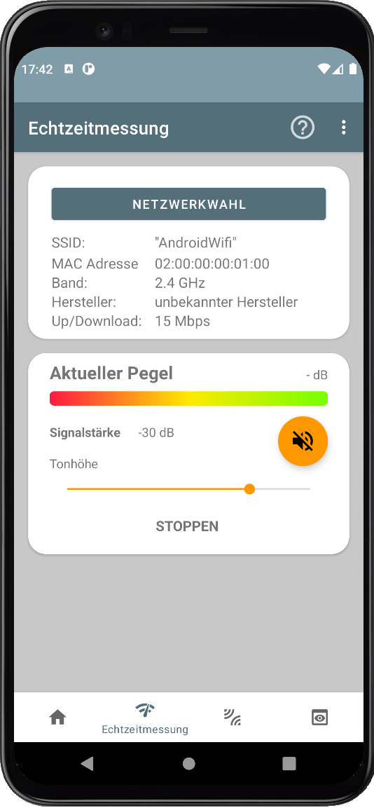
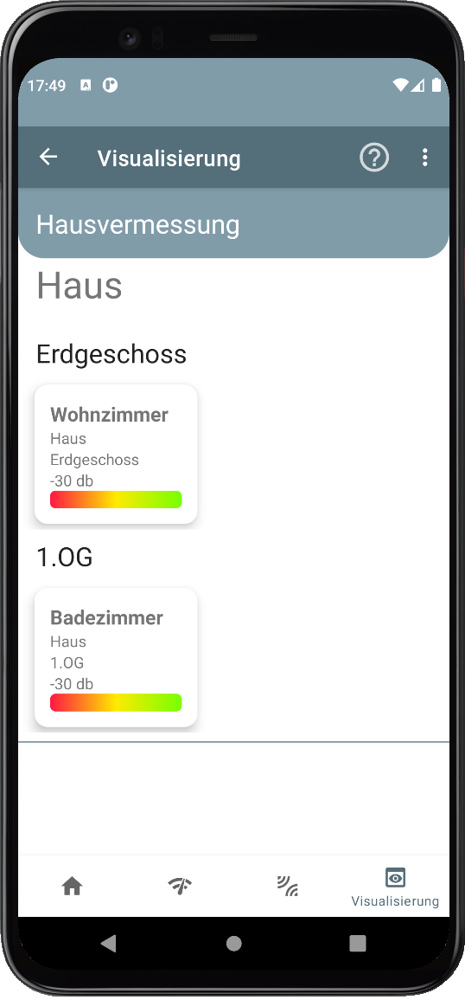
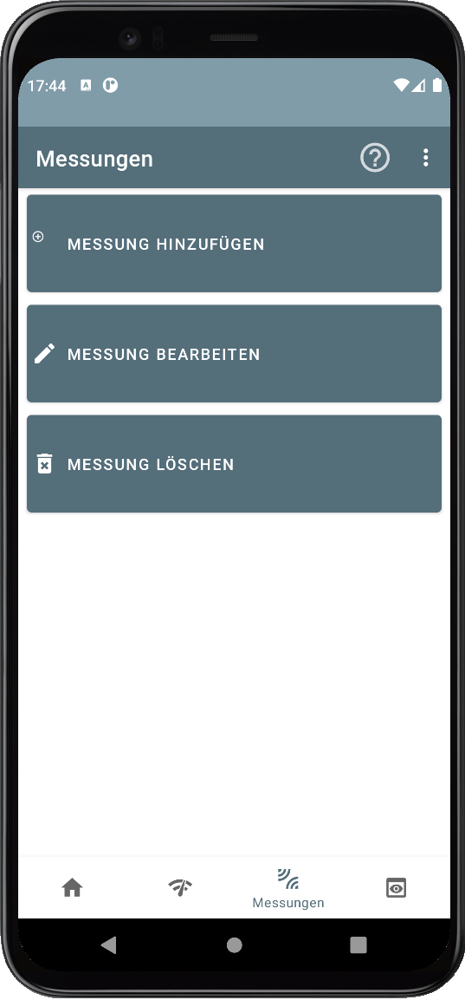
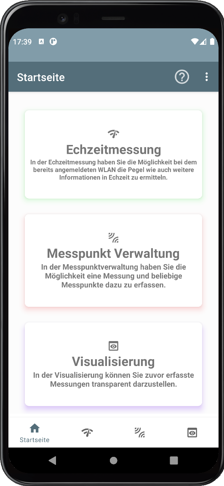

# Wlan Detektor Pro

Informationen in Deutsch

  
<b>🛠️&nbsp;&nbsp;Languages&nbsp;and&nbsp;Tools</b>

   
  

  

  
<b>🛠️&nbsp;&nbsp;Languages&nbsp;and&nbsp;Tools</b>

   
  

  
 <table border="0">
  <tr>
    <td align=center></td>
    <td align=center></td>
    <td align=center></td>
    <td align=center></td>
  </tr>
</table>

