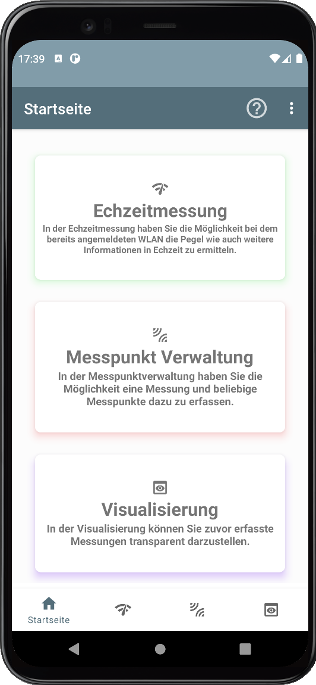
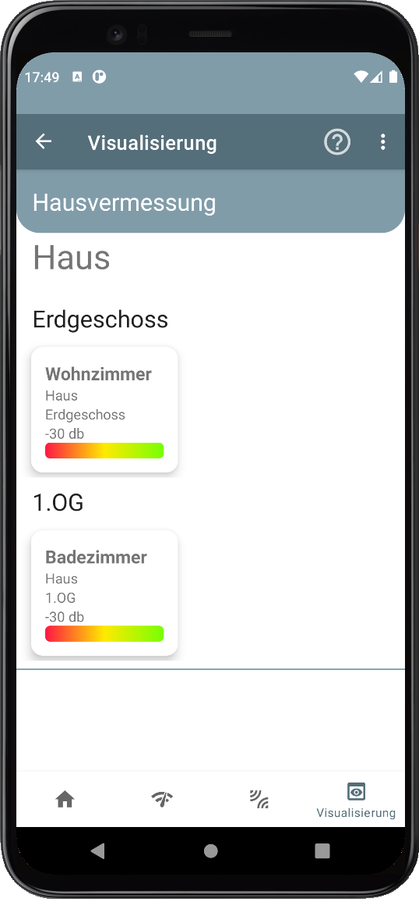

# Wlan Detektor Pro

Grüezi und herzlich Willkomme<b>

  

<table border="0">
  <tr>
    <td align=center>Startseite</td>
    <td align=center>Echtzeitmessung</td>
    <td align=center>Messung</td>
    <td align=center>Visualisierung</td>
  </tr>
  <tr>
    <td align=center></td>
    <td align=center></td>
    <td align=center></td>
    <td align=center></td>
  </tr>
</table>
